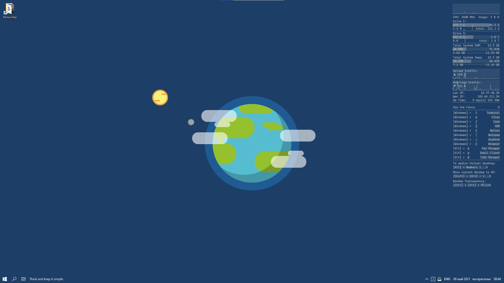
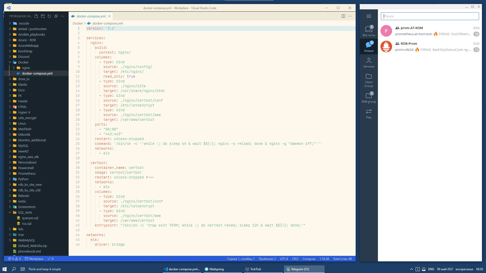
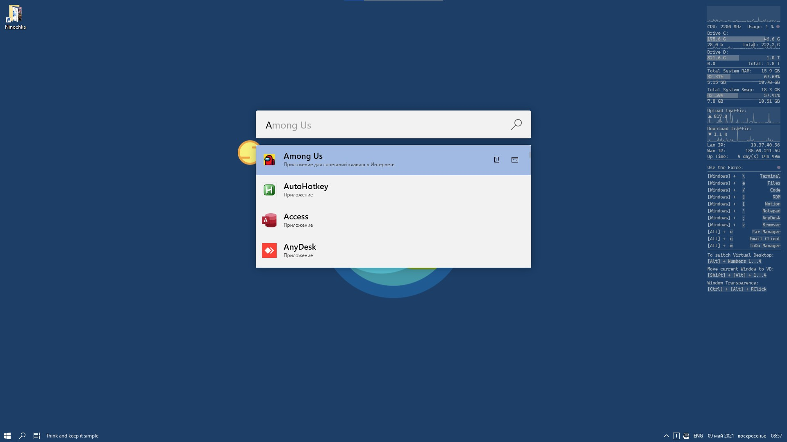
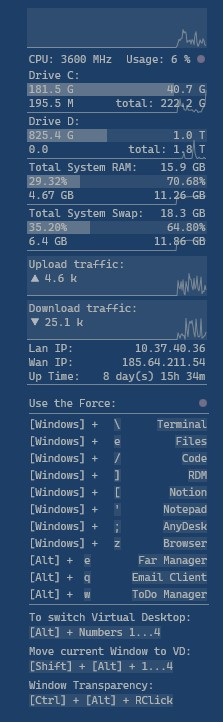
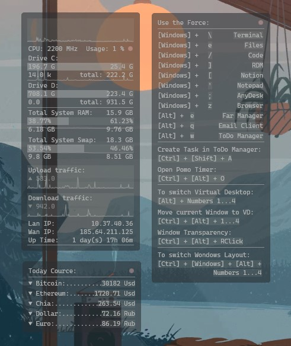
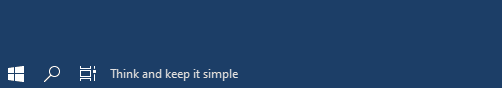
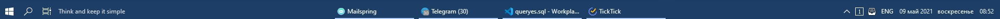
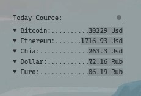

# My Windows 10 Personalized setup

## Screenshots
[](Screenshots/Desktop.jpg)
[](Screenshots/Desktop_with_apps.jpg)
[](Screenshots/Power_toys_Launcher.jpg)
[](Screenshots/Rainmeter_skins.jpg)
[](Screenshots/Rainmeter_skins_withBG.jpg)
[](Screenshots/Start_Menu_change_color.gif)
[](Screenshots/Bottom_pannel.jpg)


## Functional part:
  1. [AutoHotKey](###AutoHotKeys)
  2. [Rainmeter](###RainMeter)
  3. [PowerToys](https://github.com/microsoft/PowerToys)

## Visual Part:
  1. [T-Clock](###T-Clock)
  2. [TaskbarX](https://github.com/ChrisAnd1998/TaskbarX)
  3. [Translucent-TB](https://github.com/TranslucentTB/TranslucentTB)
  4. [ModernFlayouts](https://www.microsoft.com/en-us/p/modernflyouts-preview/9mt60qv066rp?activetab=pivot:overviewtab)
  5. [VirtualDesktopIndicator](https://github.com/zgdump/windows-virtualdesktopindicator)
  6. [AutoDarkMode](https://github.com/Armin2208/Windows-Auto-Night-Mode)

## Bonus Part:
  1. [VSCode Theme](###VSCode_Theme)
  2. [Windows Terminal](###Windows_Terminal)

## Config Descriptions

### AutoHotKeys

I used three scripts:
1. [windows-desktop-switcher](https://github.com/pmb6tz/windows-desktop-switcher) by **pmb6tz** with my _**user_config.ahk**_ file, because I turn off the functions that I do not use and change the **CapsLock** to the **Alt** key.
   
2. _**Transparent.ahk**_ to Enable/Disable transparent in focused window.
   
3. **ShortCuts.ahk** to use my custom keyboard shortcuts in Windows for start some programs

To start use you need to install [AutoHotKey](https://www.autohotkey.com/), dowload needed script files and add them in startup.

>💡 In Windows 10 you may open Autorun directory with Win + R and type:
>```
>shell:startup
>```

### RainMeter

In RainMeter I use four skins:

1. _**Winky**_ minimalist system monitor widget based on [**taboo_Vision Skin Rainmeter**](https://www.deviantart.com/jamien-price/art/taboo-Vision-Skin-Rainmeter-122032577)
2. _**ShortCut_note**_ minimalist note to use custom keyboard shortcuts.
> 💡 Some shortcuts setting ups in AHK script **ShortCuts.ahk**, some in [**PowerToys**](https://github.com/microsoft/PowerToys), and  some in ToDo Manager [**TickTick**](https://ticktick.com/)
   
3. Aditional: Crypto and Dollar widget in same style "_**CourceTicker**_"


   
To start use you need to install [Rainmeter](https://www.rainmeter.net/), dowload needed widget files and add them in skins directory. By default it in:
```powershell
cd ~\Documents\Rainmeter\Skins
```
> 💡 In my skin files I use "[Cascadia Mono](https://github.com/microsoft/cascadia-code)" font. Easy way to install it from [Chocolatey](https://community.chocolatey.org/):
>```powershell
>choco install cascadiamono
>```

### T-Clock

You need to install [T-Clock](https://github.com/White-Tiger/T-Clock). Then open Options, Time Format tab checked Advanced clock format and type:
```
dd mmm Y   dddd    HH:nn
```
---

Another soft in list You may to install, enable autostart and use by default or custom for you love.

### VSCode_Theme

[](Screenshots/VS_code_light_theme.jpg)
[](Screenshots/VS_code_dark_theme.jpg)

1. I use [Noctis](https://marketplace.visualstudio.com/items?itemName=liviuschera.noctis) theme with some custom colors. 
   
* For Light mode used "Noctis Lux":

  * _**KEYWORD**_ part orig color is: **#ff5792**, my custom color is: **#c41e3a**
  * _**editor.selectionBackground**_ orig: _**#ade2eb77**_ custom: _**#9a9a9a66**_ 
  * _**editor.selectionHighlightBackground**_ orig: _**#14a5ff33**_ custom: _**#9a9a9a66**_ 
  * _**editor.selectionHighlightBorder**_ orig: _**#14a5ff00**_ custom: _**#9a9a9a00**_ 
  * _**editor.lineHighlightBackground**_ orig: _**#d1ebefcc**_ custom: _**#c0c0c066**_ 
  * "**_source.powershell_**" parameter move to "_**ANNOTATION**_" part.

* For Dark mode used "Noctis Minimus":

  _**KEYWORD**_ part orig color is: **#af5978**, my custom color is: **#a87084** and "**_source.powershell_**" parameter move to "_**ANNOTATION**_" part.

1. Icon theme is [Helium Icon Theme](https://marketplace.visualstudio.com/items?itemName=helgardrichard.helium-icon-theme) with _"helium-icon-theme.folders.color": "**#F0B129**"_

2. Product Icons is [Carbon](https://github.com/antfu/vscode-icons-carbon)

3. Default Font is [JetBrains Mono](https://github.com/JetBrains/JetBrainsMono) and some custom settings: 
  * Size: 14
  * Ligature: true
  * Weight: 350

5. More other custom parameters in file _**.\VSCode_theme\settings.json**_

### Windows_Terminal

[](Screenshots/Terminal2.jpg)

1. in hight level part:
```json
  "initialCols": 90,
  "initialRows": 25,
  "initialPosition": "480,200",
```
for start in center of screen and with needed window size.

2. in "_**defaults**_" part used:
```json
{
  "fontFace": "JetBrains Mono",
  "useAcrylic" : true,
  "acrylicOpacity": 0.5,
  "colorScheme": "SolarizedDarkCustom"
}
```
3. in "_**schemes**_" part add: 
```json
{
  "name": "SolarizedDarkCustom",
  "black": "#002831",
  "red": "#d11c24",
  "green": "#6cbe6c",
  "yellow": "#ffd105",
  "blue": "#24a4ff",
  "purple": "#c61c6f",
  "cyan": "#259286",
  "white": "#eae3cb",
  "brightBlack": "#009CD4",
  "brightRed": "#f5163b",
  "brightGreen": "#51ef84",
  "brightYellow": "#eb9c00",
  "brightBlue": "#178ec8",
  "brightPurple": "#e24d8e",
  "brightCyan": "#00b39e",
  "brightWhite": "#fcf4dc",
  "background": "#001e27",
  "foreground": "#9cc2c3"
}
```
4. and my custom Powershell profile in file _**.\Terminal_settings\Microsoft.PowerShell_profile.ps1**_

